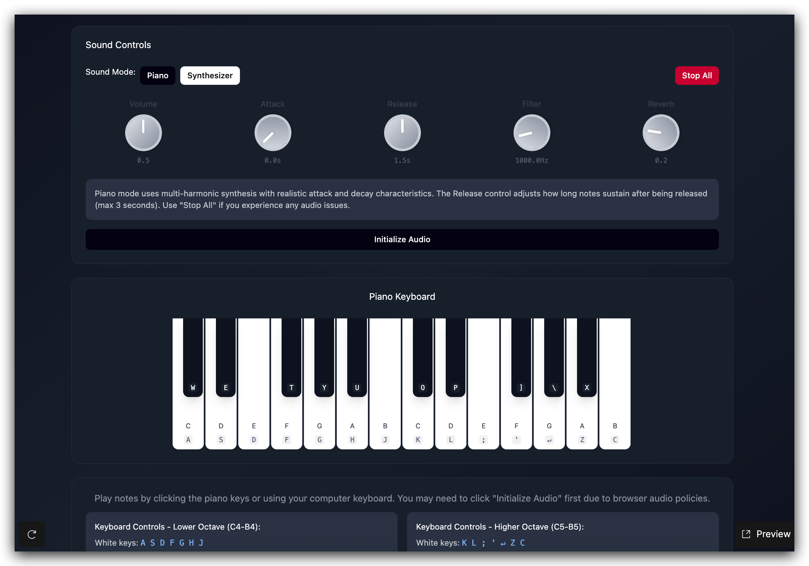

# Piano Synth

基于 Web Audio API 的钢琴模拟器和合成器，支持真实的钢琴音色合成与合成器音效。

## 技术栈

### 前端框架
- **React**: ^19.2.6
- **TypeScript**: ~6.0.2
- **Vite**: ^8.0.12

### 样式
- **Tailwind CSS**: ^4.3.0
- **PostCSS**: ^8.5.14
- **Autoprefixer**: ^10.5.0

### 开发工具
- **ESLint**: ^10.3.0
- **@vitejs/plugin-react**: ^6.0.1

### 音频处理
- **Web Audio API** (浏览器原生 API)

## 效果展示

### 钢琴模式
- 多谐波合成 (12 个分音)
- 真实的击弦噪声模拟
- 动态亮度滤波
- 弦共振效果

### 合成器模式
- 3 个失谐锯齿波振荡器
- 可调 Attack/Release 包络

### 控制器
| 控制器 | 功能说明 |
|--------|----------|
| Attack | 音符触发到最大音量的时间 |
| Release | 音符释放后的衰减时间 |
| Delay | 延迟效果时长 |
| Cutoff | 低通滤波器截止频率 |
| Gain | 主音量控制 |


<!-- 截图说明: 运行 `npm run dev` 后，在浏览器中打开 http://localhost:5173 即可看到钢琴界面 -->

## 快速开始

### 环境要求
- Node.js >= 18.0.0
- npm >= 9.0.0
- 现代浏览器 (Chrome, Firefox, Safari, Edge)

### 安装依赖

```bash
npm install
```

### 环境变量配置

本项目无需环境变量配置。

### 启动开发服务器

```bash
npm run dev
```

访问 http://localhost:5173 查看应用。

### 构建生产版本

```bash
npm run build
```

### 预览生产构建

```bash
npm run preview
```

## 项目目录结构

```
piano/
├── public/
│   └── favicon.svg
├── src/
│   ├── components/
│   │   ├── BottomInfo.tsx       # 底部信息组件
│   │   ├── BottomToolbar.tsx    # 底部工具栏
│   │   ├── Knob.tsx             # 旋钮控制器组件
│   │   ├── ModeToggle.tsx       # 模式切换组件
│   │   ├── PianoKey.tsx         # 单个琴键组件
│   │   ├── PianoKeyboard.tsx   # 钢琴键盘组件
│   │   └── SoundControls.tsx   # 声音控制面板
│   ├── hooks/
│   │   ├── useAudioEngine.ts   # Web Audio 引擎核心逻辑
│   │   ├── useKeyboardInput.ts # 键盘输入处理
│   │   └── useKnob.ts          # 旋钮交互逻辑
│   ├── lib/
│   │   ├── audio/
│   │   │   ├── constants.ts    # 音频合成常量
│   │   │   └── types.ts        # TypeScript 类型定义
│   │   └── utils.ts            # 工具函数
│   ├── App.tsx                 # 主应用组件
│   ├── index.css               # 全局样式入口
│   └── main.tsx                # React 入口文件
├── index.html
├── package.json
├── tsconfig.json
├── vite.config.ts
└── README.md
```

## 键盘快捷键

### 白键
| 琴键 | 快捷键 |
|------|--------|
| C | A |
| D | S |
| E | D |
| F | F |
| G | G |
| A | H |
| B | J |
| C | K |
| D | L |
| E | ; |
| F | ' |
| G | Z |
| A | X |
| B | C |

### 黑键
| 琴键 | 快捷键 |
|------|--------|
| C# | W |
| D# | E |
| F# | R |
| G# | T |
| A# | Y |
| C# | U |
| D# | I |
| F# | O |
| G# | P |
| A# | [ |

## 许可证

MIT
